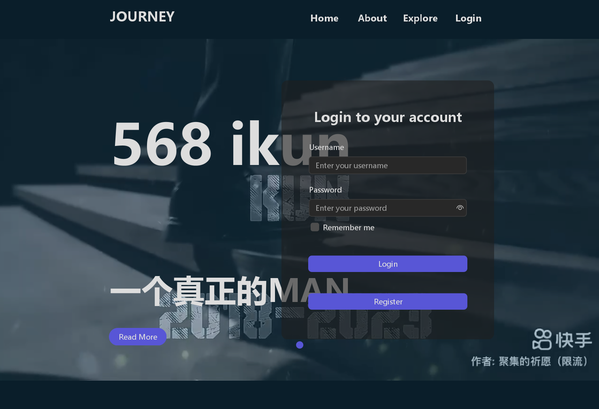

# 基于Java Swing的多功能笔记编辑软件-用户使用说明书

## 一、登录界面

* 运行程序后，弹出登录界面，点击login会出现账密输入界面，输入正确的账号密码即可进入程序主界面。
  
  

* 点击register后会出现系统用户注册界面，输入正确要求格式的昵称与自己的密码后方可正确注册账号，否则会弹出相应的错误信息。

  

## 二、主界面框架

* 顶部：当前打开文件名（如果是新建笔记，显示“新建笔记”）

* 顶部菜单栏：

  * 文件：打开、新建、保存、另存为、退出功能

  * 编辑：撤销、重做（撤销的反操作）、查找、查找上一个、查找下一个、替换、全选

  * 查看：缩放功能、状态栏

  * 帮助：查看帮助、关于记事本

  * 设置：自动换行、背景颜色、背景图片设置、字体设置、字体颜色、更多设置

* 右键菜单栏：
  * 撤销、重做、全选、删除、新建文本框、插入图片、上移一层、下移一层、置顶、置底

* 主文本框：覆盖整个框架剩余空间的文本框，可输入文本和自定义背景
* 文本框：可移动、缩放的小文本框
* 图片：可移动、缩放的图片

## 三、详细功能介绍

---

### 1、文件操作

* 打开：可选择打开当前登录用户所保存的文件，可以还原最后保存时的所有插件以及文字。当登录用户选择打开其它用户保存的文件时，会弹出提示框显示权限不足。

* 新建：新建一个新的主文本框框架。

* 保存：保存当前笔记到选定路径。

* 另存为：将当前笔记另存到指定路径。

* 退出：退出当前主文本框操作，若笔记尚未保存，则弹出提示框询问是否保存。

  

### 2、编辑操作

* 撤销：撤销上一步的操作。
* 重做：取消撤销操作。
* 查找：可在选中的文本框内（若无选中的文本框则是主文本框内）查询文本内容，可选择是否区分大小写，是否循环查询，向上查询或者向下查询的功能。

* 查找上一个：向上查询。
* 查找下一个：向下查询。

* 替换：可在选中的文本框内（若无选中的文本框则是主文本框内）根据查询输入的文本内容，并将该文本内容替换为所输入的文本内容，可以区分大小写。

* 全选：可在选中的文本框内（若无选中的文本框则是主文本框内）选中文本框内所有的内容。

### 3、查看操作

* 缩放：可在选中的文本框内（若无选中的文本框则是主文本框内）一键缩小或者放大文本框中所有的内容，也可以一键恢复默认的字体大小。
* 状态栏：可选择是否开启状态栏。若开启，状态栏将显示在主文本框的最顶层，显示内容包括：当前选中的文本框内（若无选中的文本框则是主文本框内）的文本的行数、列数、字数，当前系统时间。

### 4、帮助

* 查看帮助：点击即可获取该笔记软件的基本功能使用教程。
* 关于记事本：点击显示该笔记软件的相关开发信息。

### 5、设置操作

* 自动换行：可选择是否开启自动换行功能，开启之后全局（包括主文本框和所有创建的文本框）都会实现自动换行。
* 背景颜色：用户可自行选择，调试背景颜色，包括颜色选取，颜色的色调，饱和度，透明度等。
* 背景图片设计：用户可自行从本地选择图片，设置为主文本框的背景图片。
* 字体设计：用户可自行选择选中文本内容的字体、字号、字形，并可以实现预览功能，包括中文预览，英文预览，数字预览。

* 字体颜色：用户可自行选择，调试字体颜色，包括颜色选取，颜色的色调，饱和度，透明度等。
* 更多设置：提示更多设置正在开发。

### 6、右键编辑操作

* 全选：可在选中的文本框内（若无选中的文本框则是主文本框内）选中文本框内所有的内容。
* 复制：可将选择的文本内容复制（快捷键CTRL+C）。
* 粘贴：可将复制的文本内容粘贴（快捷键CTRL+V）。
* 剪切：可将选择的文本内容剪切（快捷键CTRL+X）。
* 撤销：撤销上一步的操作。
* 重做：取消撤销操作。

* 删除：
  * 删除指定文本框或图片，同时维持所有文本框和图片的图层顺序不变
* 新建文本框：
  * 立即在鼠标处插入一个默认大小的文本框，默认置于当前最上层且无自动换行
* 新建图片：
  * 选定本地指定路径的图片文件，并立即在鼠标处插入（如果图片宽度<=640,高度<=480，按原大小插入，否则，会将图片设置为<=640*480的大小），图片的默认置于当前最上层
  
* 图层操作：上移一层、下移一层
  * 可类比Word的操作，同字面意思，但是始终保证主文本框在最底层。

### 7、文本框/图片操作

* 点击文本框/图片，出现蓝色边框，表示当前已聚焦到指定文本框/图片（所有编辑操作将针对当前文本框/图片，如果没有聚焦到文本框/图片，默认对主文本框进行操作）。
* 点击聚焦容器的蓝色边框四角并拖拽，进行缩放操作（默认宽高不得小于20*20），对于图片，不锁定宽高比。
* 点击蓝色边框四边并拖拽，进行移动操作。

## 四、运行环境配置说明
* 程序入口：`src/main/java/raven/main/Main.java`
* 本项目采用maven架构
* 首先本地下载好MySQL、MySQL-connector-j-8.2.0和Datagrip来用于Java程序与数据库连接
* 接着调试好MySQL与Gatagrip后，将名为check的表作为我们用户管理系统的数据表，其中name列表示用户昵称，pwd列表示用户密码，然后将MySQL-connector-j-8.2.0.jar作为项目的库依赖之一，即可成功连接数据库与本Java程序
* 其次下载好vlc-3.0.20-win64.exe，此程序为程序登录界面的音频播放器