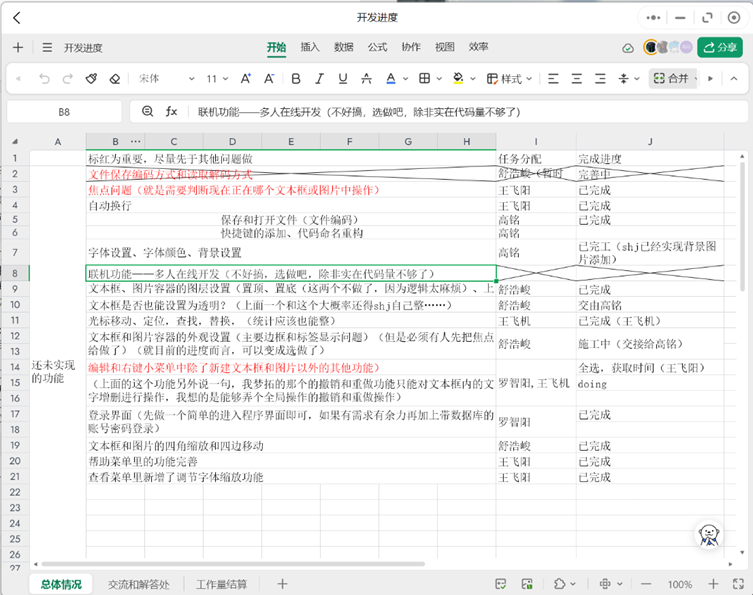
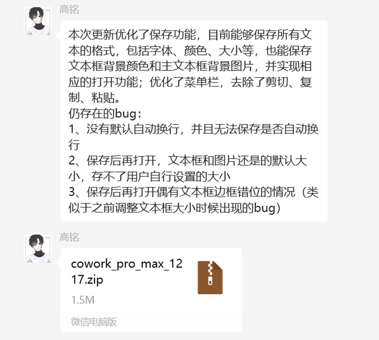
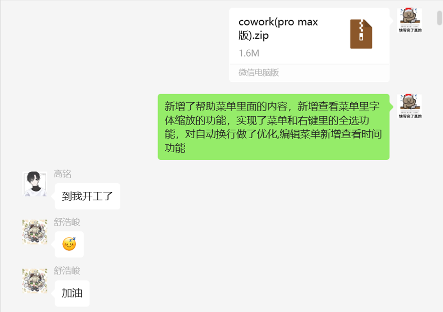
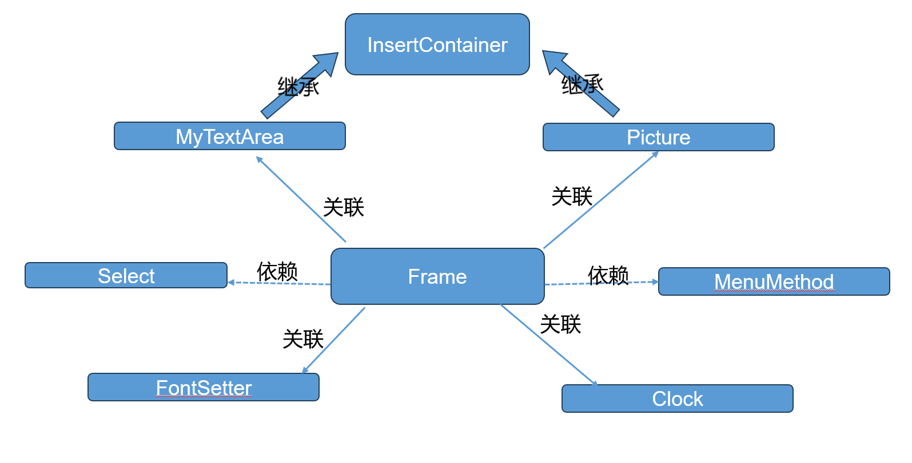

# Java大作业开发文档
## 一、作品名称

> ### 基于Java Swing的多功能笔记编辑软件

## 二、小组名称
> ### 568ikun

## 三、小组成员及分工：
**王飞阳 22373407** 
工作：解决焦点问题，光标移动问题，实现自动换行功能；定位，查找，替换功能；全选功能；获取时间功能；完善帮助菜单里的内容；新增了调节字体缩放功能；新增状态栏功能；答辩ppt制作。（权重1）
	
**舒浩峻 22371315**
工作：基础框架的搭建、前期调试文件操作功能的实现以及文本框、图片的插入和编辑操作（缩放、移动、图层），答辩。（权重1）

**高铭 22373386**
工作：解决保存和打开文件问题（文件编码），实现用户访问权限设置；实现字体设置、字体颜色、背景设置；进行整个项目细节的优化和完善；按照javadoc要求统筹编写各部分注释。（权重1）

**罗智阳 22373497**
工作：编辑和右键小菜单中除了新建文本框和图片以外的其他功能的完善（复制，粘贴，撤销，重做等），登录界面的制作，数据库的建立，将文件与用户绑定问题。答辩。（权重1）

## 四、团队协作方式：
1. **进度规划**：在大作业任务发布后3天预约研讨室进行项目进度规划讨论，确定在中期检查之前完成整个项目的基础框架搭建工作，要求初具雏形，实现一些最基本的功能；在最终检查前1周完成各自的代码，并与其它小组成员对接。在最后1星期进行修改测试和完善。
2. **项目设计**：根据前期对项目的总体规划与主要功能确定，将项目设计分为4大部分。由舒浩峻同学负责整个笔记软件的前期框架搭建，制作出笔记软件的基础；由罗智阳同学负责笔记软件的登录界面设计，数据库的搭建，用户信息保存；由高铭和王飞阳同学负责笔记软件各个基础功能的实现与完善。
3. **资料收集**：主要通过在CSDN上查询、阅读官方文档、询问chatgpt、询问助教等方式，学习JavaSwing的相关知识。
4. **代码编写**：通过线上表格分工合作，进行协同编码。主要采取微信发压缩包的形式，进行代码的合作编写。（附图）

## 五、项目介绍：
1. **背景**：
随着电子设备的普及，越来越多的学生会选择在电子产品上做笔记而不是写纸质笔记。但是，对于现在的很多笔记软件，我们实际去体验的时候，发现他们的软件功能虽然齐全，但是存在很多不合理的、不够人性化的地方，很多地方都可以得到改进。
2. **目的**：
我们一方面打算自己也做一个文本编辑软件（至少要比Windows自带的记事本要高级，功能更齐全），另一方面我们想对于一些功能往人性化的方向做优化。于是我们就仿照Word的设计，用Java Swing自制了一个简易的文本编辑软件。
3. **项目整体架构**:

## 六、项目开发环境：
1. **硬件种类：**
笔记本电脑
台式电脑

2. **JDK 版本**
openjdk-20.0.2

3. **操作系统**
Windows 11 系统

4. **集成开发环境**
IntelliJ IDEA 2023.2.4
DataGrip 2023.2.3

## 七、项目运行环境：
1. **硬件种类：**
笔记本电脑
台式电脑

2. **JDK 版本**
openjdk-20.0.2

3. **操作系统**
Windows 11 系统

4. **数据库**
MySQL
Connecter: mysql-connector-j-8.2.0.jar

## 八、素材来源
登录界面视频：快手@聚集的祈愿（限流版）